# Organization Application Technical Specification

> Written by [Tejas Chandramouli](https://github.com/tchandr) for the CSXL Web Application.

This document contains the technical specifications for the new Organization features for the CSXL web application. This feature so far adds _5_ new database tables, _15_ new API routes, and _4_ new frontend component to the application.

SP02 focused on adding functionality for the application page on both the member and admin side, which was only a mockup frontend in SP01. Users are now able to apply to organizations, and admins can accept or deny these applications, changes of which are reflected on the organization page.

SP02 also includes a user members list with Academic term listing. This is dynamically reflected with user joining, leaving, and application acceptance/denial.

SP02 also adds an announcements tab, with admin ability to post announcements, and Users viewing announcements if they are a member.

## Demo Walk-through<a name='Demo'></a>

### Organization Members Listed & Messages<a name='Org Members and Messages'></a>

Once you are at the CSXL website and in the Organizations tab using the side menu, you can select any organization to collect their details. The changes that we made now allows a member of that organization to view all members of that organization in a list, including their name and academic term. We have also added an Organization Messages widget on the right side so that members of an organization can send out announcements.
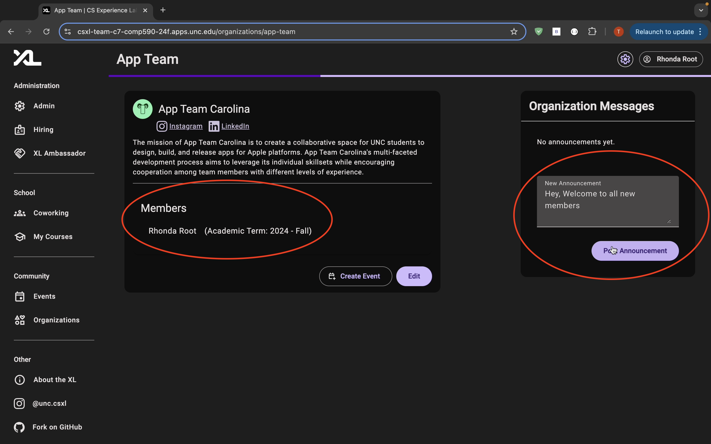
As you can see, Rhonda is a member of App Team Carolina and wants to send out a message/announcement.

Once an announcement is made, other members of the organization will be able to see it in the organization details as well!
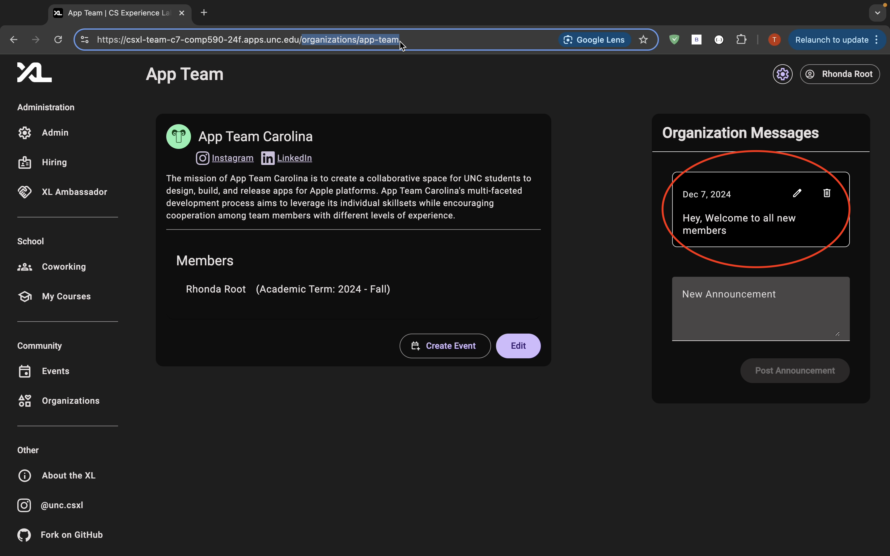

### Student Application<a name='Apply'></a>

As mentioned, our 'Apply' button in the last sprint was just a front-end mockup with no functionality. Well now, as a student you are able to apply to an organization straight from the CSXL website!

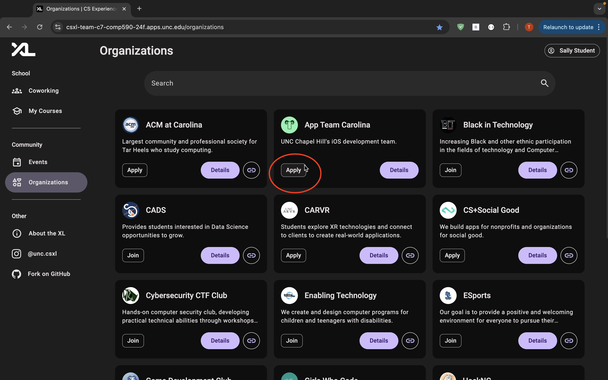
Here you can see, as Sally Student, the 'Apply' button is visible for organizations that you are not apart of and are open to application. Once clicked, you will be redirected to the new application form page.

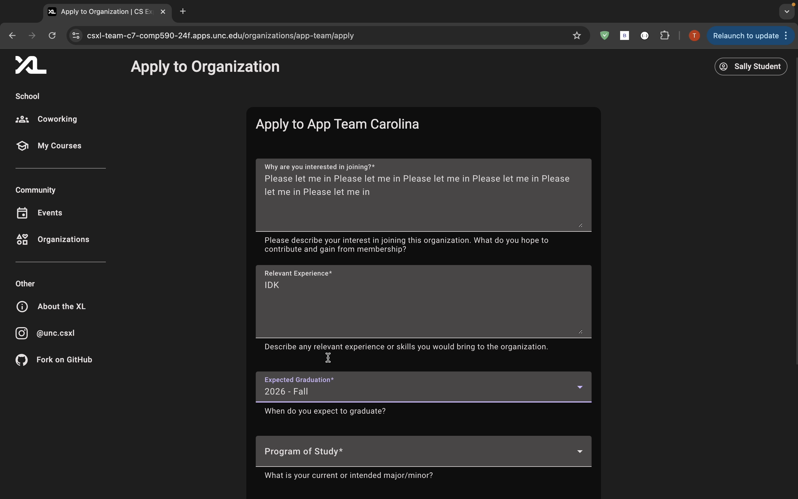
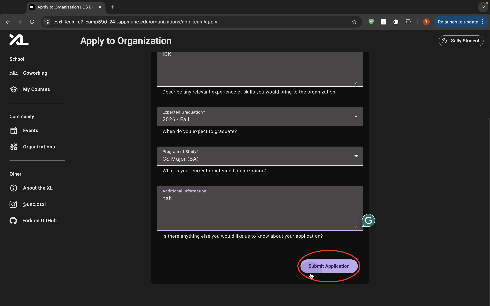
Here as you can see, we have setup an application form for students to fill out short questions. All that's left for the student to do is answer the questions an press 'Submit Application'!

### Admin Application Review<a name='Apply Review'></a>

As an admin of an organization, we have added the functionality in order to review, deny, and accept applications.

As an admin(Rhonda Root), you can navigate to the organizations page. In the top right, select the gear widget to redirect you to Organization Administration
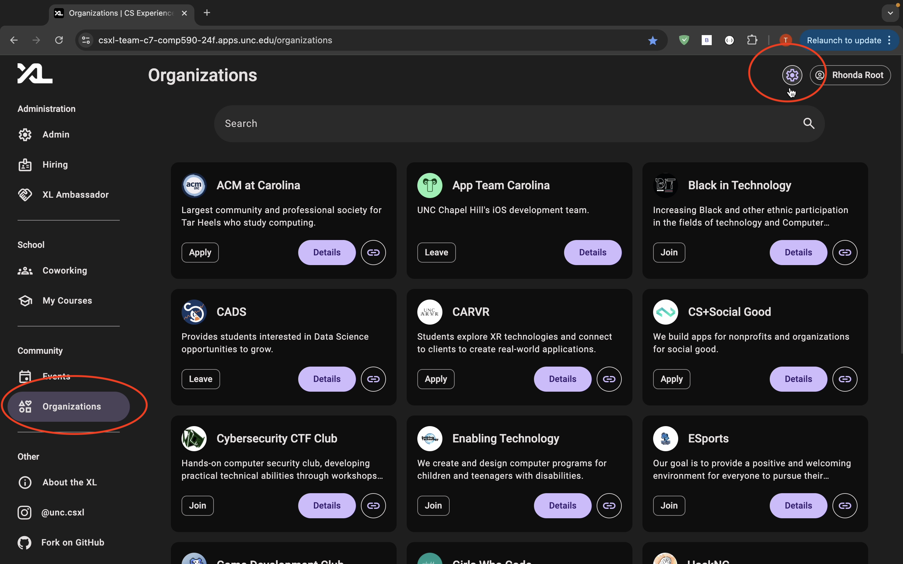

In Organization Administration, it will list all of the organizations you are an admin of. Select 'Applications' in the desired organization tab.
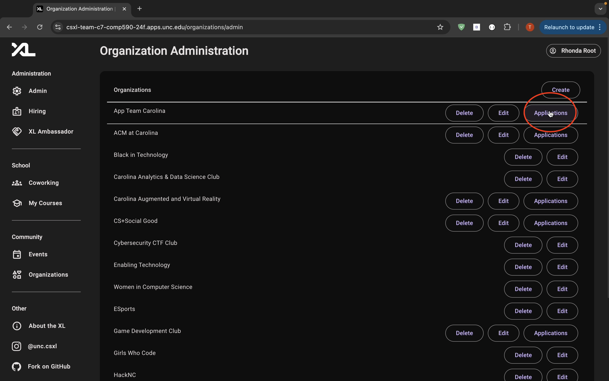

Here in the Admin Application page, you can review student applications. On the right side under actions, there are 3 widgets for an application: details, approve, and deny.
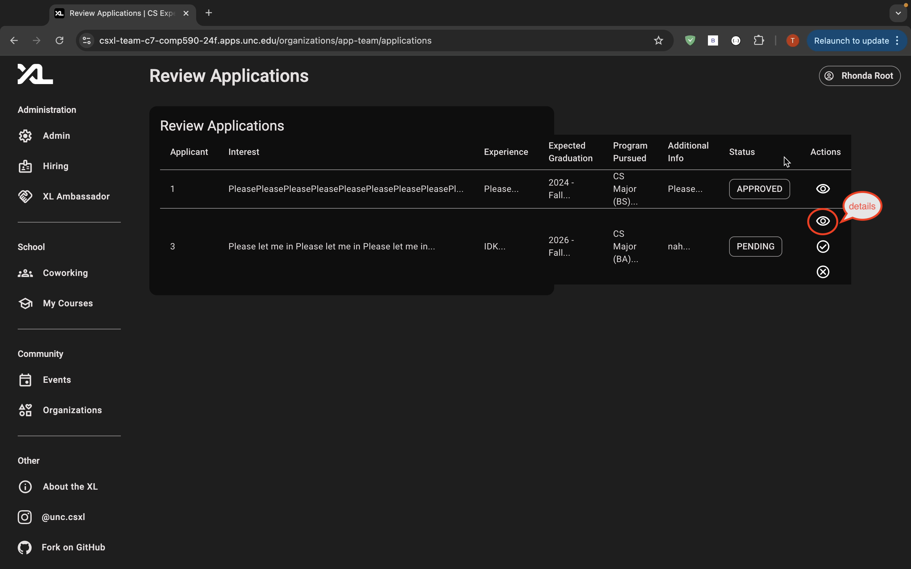

Here in the details, you are able to review all of the answered questions and information regarding the student appying.
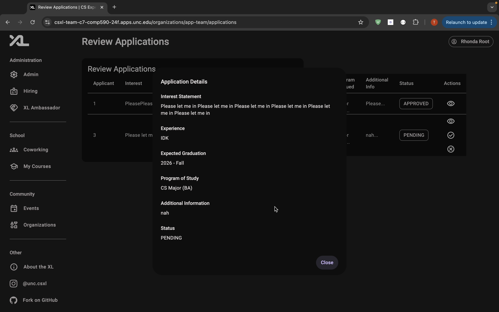
After reviewing an application, the admin can deny or approve the request.

### New Member!<a name='New Member'></a>

After an admin reviews an application and decides to accept a student, the changes will automatically be made on the Admin Application Review page and change that students status to approved.
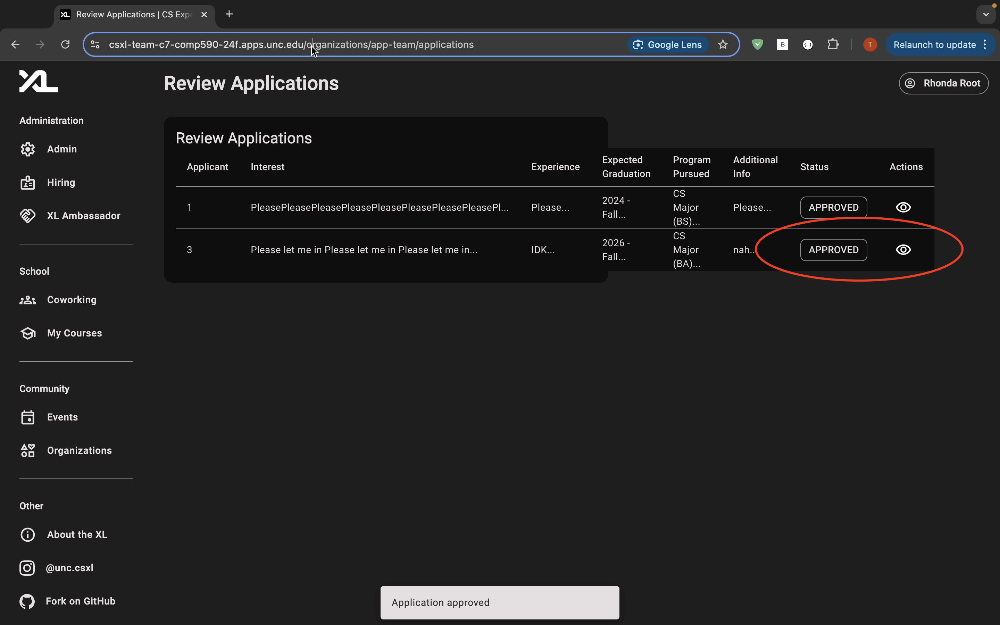

Finally, as a new member of an organization (Sally Student), you can go back to the organization details page and be able to see your name under the members list, as well as your academic term, every member in the organization, view organization messages, and post organization messages!
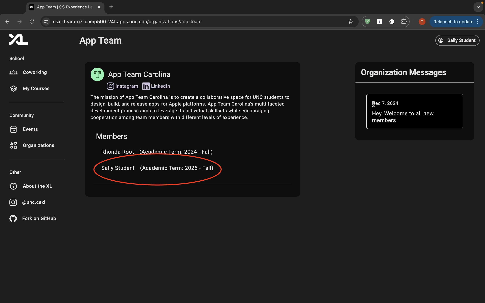

## Descriptions/Sample Data<a name='Descriptions/Sample Data'></a>

There are two new models that was added, OrganizationApplication and OrganizationMessages. We also added an ApplicationStatus Model for enums.

```py
OrganizationApplication:
    "id": int | None = None
    "user_id": int
    "organization_id": int
    "status": ApplicationStatus = ApplicationStatus.PENDING
    "interest_statement": str
    "experience": str
    "expected_graduation": str
    "program_pursued": str
    "additional_info": str
    "admin_response": str | None = None
```

```py
OrganizationMessages:
    "id": int | None = None
    "organization_id": int
    "user_id": int
    "content": str
    "created_at": datetime | None = None
```

Subsequent API routes were created to support these functions, as seen in Organization and Organization_Application.

## Database/Entity Decisions<a name='Database/Entity Decisions'></a>

In addition to the SP01 relationships, the Messages and Applications are a part of the OrganizationDetails model, for further abstraction and SoC. These result in Many-to-Many relationships between Users, OrganizationDetails, and the needed entity. Users are allowed to have applications for multiple organizations, and organizations are able to have applications from multiple users. Same logic applies to the announcements.

## Decisions and TradeOffs<a name='Decisions and Tradeoffs'></a>

**UX Decision-** We decided to disallow admins to be members of an organization, until an admin accepts the application. This is partially because the CSXL website doesn't have a global academic term, and the only way to add this was to retrieve it from the application. This means that only organizations with applications will have the academic term listed. This can be edited for future use, but the level of importance for application-based organization is what led us to this decision.

**Technical Decision-** One technical decision we made was having a universal application for all clubs, in the sense that all organizations would have the same application structure. This was because creating a form-control document that organization-admins themselves could edit and deploy would have taken a lot of time. The middle ground we came with is a comprimise between this high level concept, and a google form link.

## Development Decisions<a name='Development Decisions'></a>

**FrontEnd**

Multiple widgets were added, as well as another routing component. This inlcudes organization-application.model.ts, organization-application-reivew component files, organizatoin-apply component files, and the organization-messages and organization-members-card widgets. All of these work together to fill out the user story.

**Backend**

-As mentioned before, there were two major functionalities created. This includes the OrganizationMessages and OrganizationApplication models, entities, and service functions.

To comprehensively get started, follow this path.

-Backend: Look at the Organization_application and Organization API functions, as these are the closest to the frontend functions.
Organization_Application, Organization_messages, and Organizaiton Entities would be next, as well as these models and services. For the frontend, look at the model files, such as Organization-Application model and Organization-Message model
